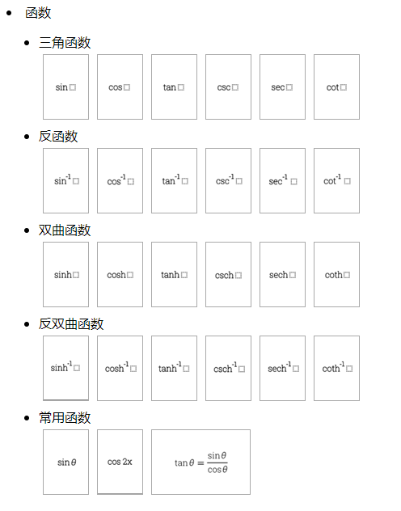

## 下载与使用

```bash
yarn add formula-template
# npm i formula-template
```

```js
import config from 'formula-template/dist/config.json'
import groupsSpriteImage from 'formula-template/dist/groups.png'
import symbolsSpriteImage from 'formula-template/dist/symbols.png'
```

> config为配置信息，具体可参见配置对象。
> groups.png与symbols.png分别表示组与符号下的模板图所组成的雪碧图，配置中有每个模板图在雪碧图中的位置与大小。

## 配置

**Config**

属性 | 说明 | 类型 | 可选值
-- | -- | -- | --
groups | 模板组 | Array\<Group\> | -
symbols | 符号组 | Array\<Group\> | -

**SpriteImage**

属性 | 说明 | 类型 | 可选值
-- | -- | -- | --
position | 位置 | Object | -
position.x | x坐标 | Number | -
position.y | y坐标 | Number | -
position.width | 宽度 | Number | -
position.height | 高度 | Number | -

**Group**

属性 | 说明 | 类型 | 可选值
-- | -- | -- | --
name | 组名 | String | -
title | 组中文名 | String | -
image | 图片 | SpriteImage | -
elements | 模板元素集合 | Array\<Element\> | -

**Element**

属性 | 说明 | 类型 | 可选值
-- | -- | -- | --
image | 图片 | SpriteImage | -
exp | 表达式 | String | -

## 维护模板

**配置符号组**

找到`src/config/symbols`目录下的`index.js`文件，如：

```js
const symbols = [
  {
    name: 'base',
    title: '基础数学'
  }
]
```
表示新增一个名为`base`的符号组，配置好组后，需要在目录下新建一个与组名相同的文件，如上面的配置新增一个`base`文件即可（无需后缀名），然后在该文件下按行录入公式的表达式即可（可随意空行，每行一个表达式），如：

```
\pm
\infty
=
\ne
\sim
```

> 工具会将配置中的表达式生成为一个小图，然后将所有的小图合并到一张大图中，即`dist`目录下的`symbols.png`文件。

**配置模板组**

找到`src/config/groups`下的`groups.yml`文件，补充配置，如：

```yml
- frac-分数:
   - base-分数
   - common-常用分数
- supsub-上下标:
   - base-上标和下标
   - common-常用的上标和下标
```

其中，`-`为分隔符，左侧为组的名称，右侧为组的标题。支持无限层级。

配置好组后，需要在`images`目录下新增每个组的模板列表与每个模板对应的图片，与`groups.yml`中配置的一样，目录结构按照此配置中的结构进行配置，如：

```
images/frac/base
```

一般情况下在最后一层（叶子节点）需要配置所有的公式模板，在该目录下新建`exp.json`文件，如：

```json
{
  "1": "\\frac{ }{ }",
  "2": "^{}/_{}"
}
```

同时，准备与json文件中配置的同样个数的图片文件（必须以png为后缀名），文件名为json文件中的key。如上图的配置需要在json文件所在目录下放置`1.png`与`2.png`两张图片。

**生成配置与大图**

```bash
yarn build
```

构建成功后，在`dist`目录查看结果。